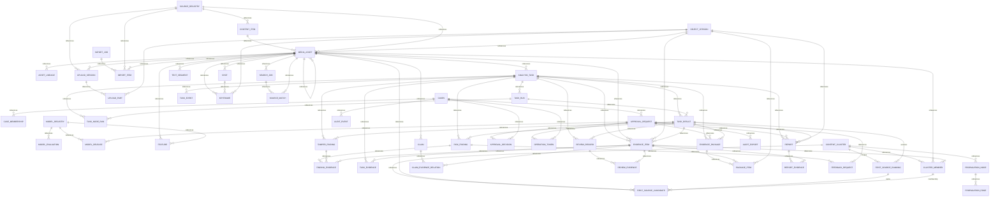

# 数据关系图

```mermaid
erDiagram
    CASES ||--o{ CASE_MEMBERSHIP : references
    SOURCE_REGISTRY ||--o{ CONTENT_ITEM : references
    CONTENT_ITEM ||--o{ MEDIA_ASSET : references
    SOURCE_REGISTRY ||--o{ MEDIA_ASSET : references
    OBJECT_VERSION ||--o{ MEDIA_ASSET : references
    MEDIA_ASSET ||--o{ MEDIA_ASSET : references
    MEDIA_ASSET ||--o{ ASSET_LINEAGE : references
    SOURCE_REGISTRY ||--o{ UPLOAD_SESSION : references
    MEDIA_ASSET ||--o{ UPLOAD_SESSION : references
    UPLOAD_SESSION ||--o{ UPLOAD_PART : references
    OBJECT_VERSION ||--o{ UPLOAD_PART : references
    IMPORT_JOB ||--o{ IMPORT_ITEM : references
    SOURCE_REGISTRY ||--o{ IMPORT_ITEM : references
    MEDIA_ASSET ||--o{ IMPORT_ITEM : references
    MEDIA_ASSET ||--o{ ANALYSIS_TASK : references
    ANALYSIS_TASK ||--o{ TASK_RUN : references
    ANALYSIS_TASK ||--o{ TASK_RESULT : references
    TASK_RUN ||--o{ TASK_RESULT : references
    ANALYSIS_TASK ||--o{ TASK_NODE_RUN : references
    TASK_RUN ||--o{ TASK_NODE_RUN : references
    ANALYSIS_TASK ||--o{ TASK_EVENT : references
    MEDIA_ASSET ||--o{ SHOT : references
    MEDIA_ASSET ||--o{ KEYFRAME : references
    SHOT ||--o{ KEYFRAME : references
    OBJECT_VERSION ||--o{ KEYFRAME : references
    MEDIA_ASSET ||--o{ TEXT_SEGMENT : references
    MODEL_REGISTRY ||--o{ MODEL_EVALUATION : references
    MODEL_REGISTRY ||--o{ MODEL_RELEASE : references
    APPROVAL_REQUEST ||--o{ MODEL_RELEASE : references
    MEDIA_ASSET ||--o{ FEATURE : references
    MODEL_REGISTRY ||--o{ FEATURE : references
    ANALYSIS_TASK ||--o{ EVIDENCE_ITEM : references
    MEDIA_ASSET ||--o{ EVIDENCE_ITEM : references
    OBJECT_VERSION ||--o{ EVIDENCE_ITEM : references
    TASK_RESULT ||--o{ EVIDENCE_ITEM : references
    ANALYSIS_TASK ||--o{ RISK_FINDING : references
    TASK_RESULT ||--o{ RISK_FINDING : references
    ANALYSIS_TASK ||--o{ TAMPER_FINDING : references
    TASK_RESULT ||--o{ TAMPER_FINDING : references
    RISK_FINDING ||--o{ FINDING_EVIDENCE : references
    TAMPER_FINDING ||--o{ FINDING_EVIDENCE : references
    EVIDENCE_ITEM ||--o{ FINDING_EVIDENCE : references
    ANALYSIS_TASK ||--o{ TASK_EVIDENCE : references
    EVIDENCE_ITEM ||--o{ TASK_EVIDENCE : references
    MEDIA_ASSET ||--o{ SEARCH_JOB : references
    SEARCH_JOB ||--o{ SOURCE_MATCH : references
    MEDIA_ASSET ||--o{ SOURCE_MATCH : references
    CONTENT_CLUSTER ||--o{ CLUSTER_MEMBER : references
    MEDIA_ASSET ||--o{ CLUSTER_MEMBER : references
    EVIDENCE_ITEM ||--o{ CLUSTER_MEMBER : references
    CONTENT_CLUSTER ||--o{ FIRST_SOURCE_CANDIDATE : references
    MEDIA_ASSET ||--o{ FIRST_SOURCE_CANDIDATE : references
    CONTENT_CLUSTER ||--o{ PROPAGATION_NODE : references
    PROPAGATION_NODE ||--o{ PROPAGATION_EDGE : references
    MEDIA_ASSET ||--o{ CLAIM : references
    CLAIM ||--o{ CLAIM_EVIDENCE_RELATION : references
    EVIDENCE_ITEM ||--o{ CLAIM_EVIDENCE_RELATION : references
    CASES ||--o{ APPROVAL_REQUEST : references
    APPROVAL_REQUEST ||--o{ APPROVAL_DECISION : references
    CASES ||--o{ APPROVAL_DECISION : references
    APPROVAL_REQUEST ||--o{ OPERATION_TOKEN : references
    CASES ||--o{ OPERATION_TOKEN : references
    ANALYSIS_TASK ||--o{ REVIEW_RECORD : references
    TASK_RESULT ||--o{ REVIEW_RECORD : references
    REVIEW_RECORD ||--o{ REVIEW_EVIDENCE : references
    EVIDENCE_ITEM ||--o{ REVIEW_EVIDENCE : references
    ANALYSIS_TASK ||--o{ EVIDENCE_PACKAGE : references
    APPROVAL_REQUEST ||--o{ EVIDENCE_PACKAGE : references
    TASK_RESULT ||--o{ EVIDENCE_PACKAGE : references
    EVIDENCE_PACKAGE ||--o{ PACKAGE_ITEM : references
    EVIDENCE_ITEM ||--o{ PACKAGE_ITEM : references
    OBJECT_VERSION ||--o{ PACKAGE_ITEM : references
    ANALYSIS_TASK ||--o{ REPORT : references
    APPROVAL_REQUEST ||--o{ REPORT : references
    OBJECT_VERSION ||--o{ REPORT : references
    TASK_RESULT ||--o{ REPORT : references
    REPORT ||--o{ REPORT_EVIDENCE : references
    EVIDENCE_ITEM ||--o{ REPORT_EVIDENCE : references
    RISK_FINDING ||--o{ FEEDBACK_REQUEST : references
    APPROVAL_REQUEST ||--o{ FEEDBACK_REQUEST : references
    CASES ||--o{ AUDIT_EVENT : references
    APPROVAL_REQUEST ||--o{ AUDIT_EXPORT : references
    CONTENT_CLUSTER ||--o{ FIRST_SOURCE_RANKING : scopes
    TASK_RESULT ||--o{ FIRST_SOURCE_RANKING : versions
    FIRST_SOURCE_RANKING ||--o{ FIRST_SOURCE_CANDIDATE : ranks
    CLUSTER_MEMBER ||--o{ FIRST_SOURCE_CANDIDATE : membership
```
